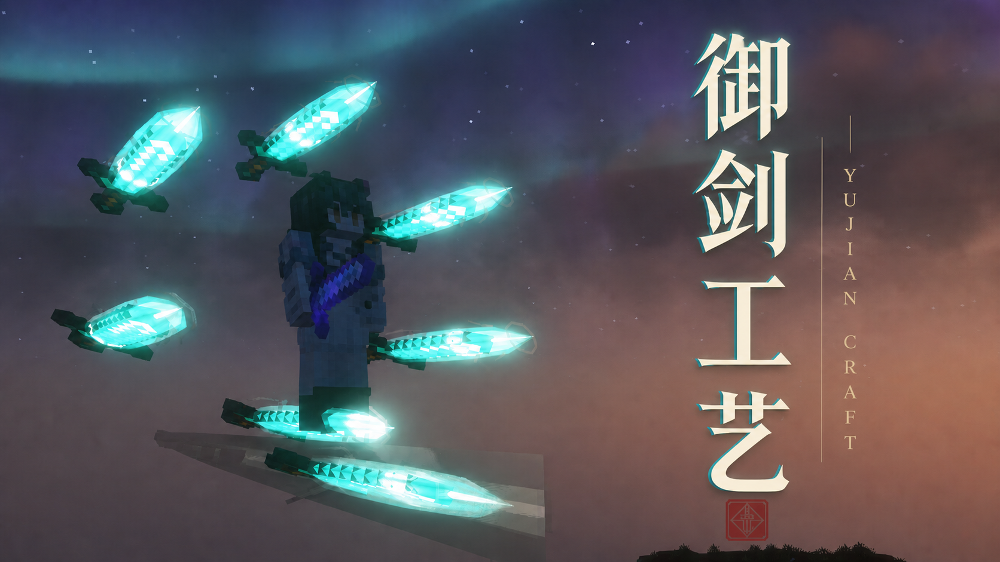
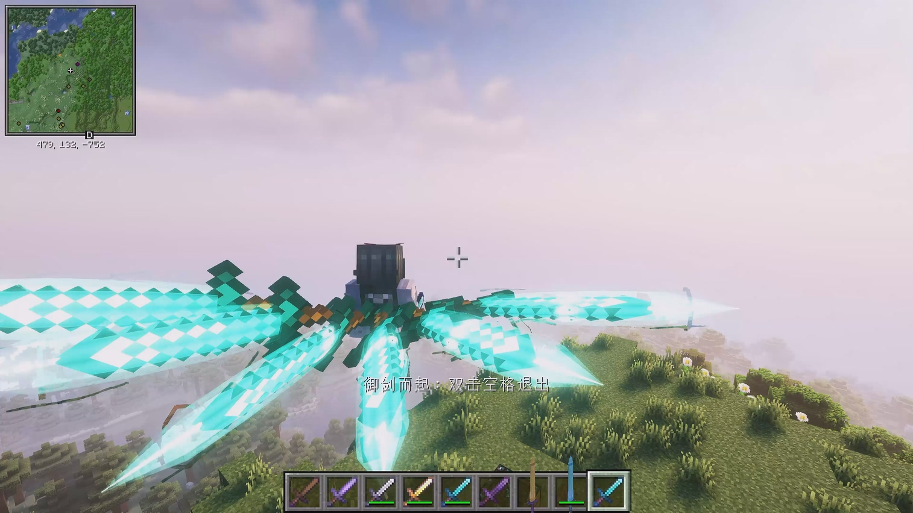
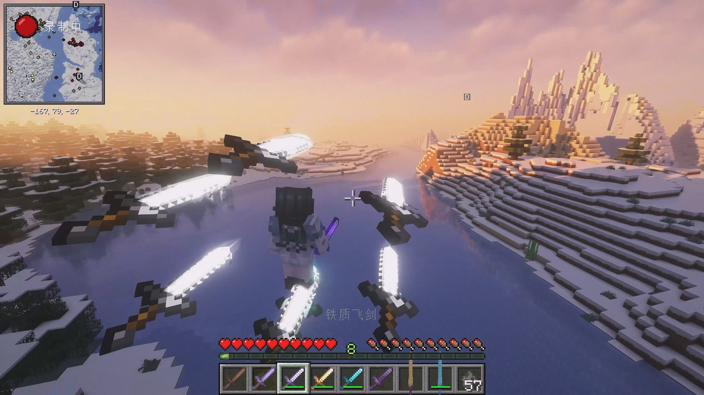
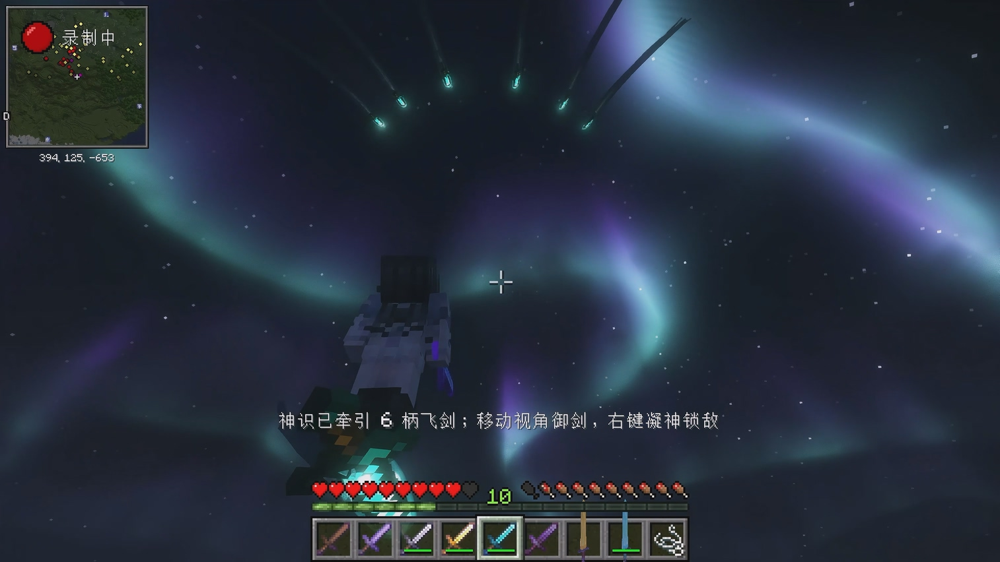
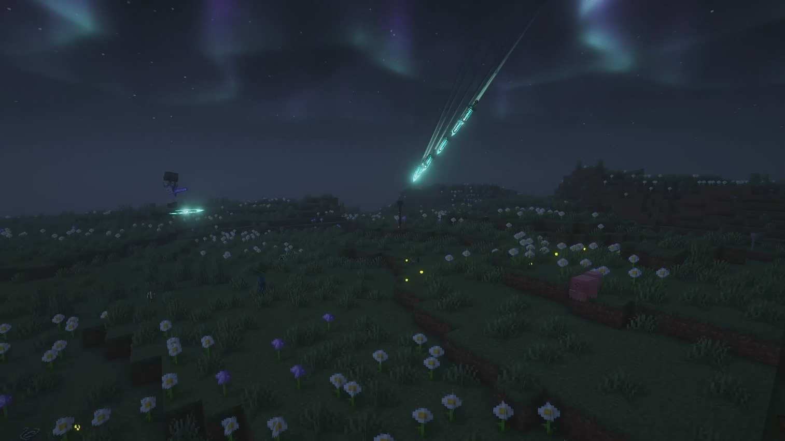
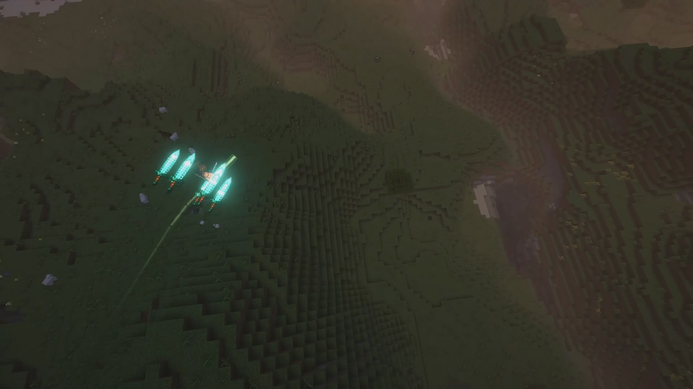
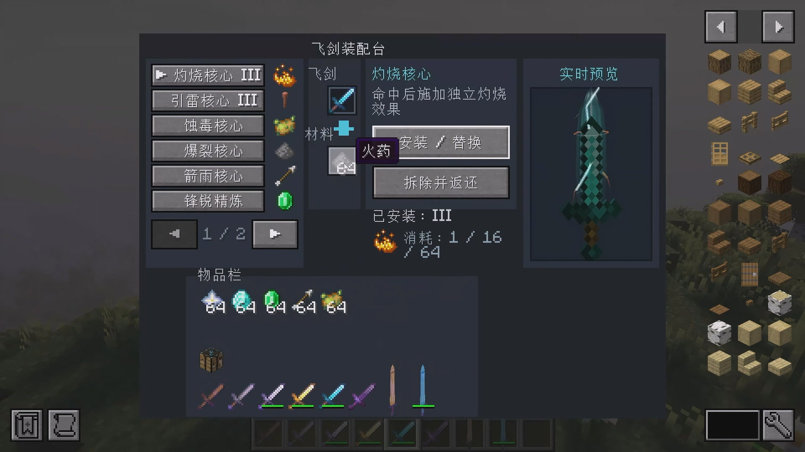

# 御剑工艺 / Yujian Craft

  

  <strong>以神识驭剑，以原版材料铸造属于 Minecraft 的飞剑战斗。</strong> 
  <em>Forge flying swords from familiar Minecraft materials, command them in formation, and take to the sky.</em>

  <a href="https://www.curseforge.com/minecraft/mc-mods/yujian-craft">CurseForge</a>
  · <a href="https://github.com/forThousands/YujianCraft/releases">GitHub Releases</a>
  · <a href="CHANGELOG.md">Changelog</a>
  · <a href="https://github.com/forThousands/YujianCraft/issues">Issues</a>

> **当前版本 / Current version:** `0.9.19`（开发预览 / Development Preview） 
> **环境 / Environment:** Minecraft `1.20.1` · Forge `47.4.22` · Java `17` · Client & Server 
> **协议 / License:** [MIT](LICENSE) · 无必需前置模组 / No required third-party dependency

## 模组简介 / About

御剑工艺是一个原创的 Minecraft Forge 御剑战斗与制作模组。它以原版材料、锻造和附魔语言为基础，加入六柄飞剑组成的动态剑阵、三种索敌方式、持续穿刺、御剑飞行，以及可以自由安装和拆卸的飞剑模块。

Yujian Craft is an original flying-sword combat and crafting mod for Minecraft Forge. Built around vanilla materials and progression, it adds six-sword formations, three targeting styles, repeated piercing attacks, sword riding, and a reversible module system.

## 剑阵与战斗 / Formations & Combat

  
  

模式 A 正向扇形阵 / Mode A forward fan · 模式 B 环形阵 / Mode B ring

- 六柄飞剑在玩家身后列阵，停靠、出击、回剑均使用平滑轨迹。
- 三种阵型各有独立的净空与追击路线，避免飞剑穿过玩家。
- 剑尖始终跟随飞行方向；剑罡、灵力流动、材质尾迹和破空声共同表现速度与力量。
- 单次出击适合稳定战斗；持续穿刺会越过目标、沿弧线折返，直至目标死亡或失效。

Six flying swords dock behind the player and transition smoothly between formation, attack, and return paths. Each formation uses its own clearance route, while blade orientation, energy shells, material-colored trails, and flight audio reinforce direction and speed. Choose reliable single passes or repeated piercing runs that curve back through the target.

| 阵型 / Formation | 行为 / Behaviour |
| --- | --- |
| **A（默认）正向扇形 / Forward Fan (default)** | 先向外净空并抬升，再追击目标 / Clears the player, climbs, then pursues |
| **B 环形 / Ring** | 位于玩家侧后方，可直接向前出击 / Docks around the rear flanks and launches directly |
| **C 侧锋扇形 / Side-blade Fan** | 保留独特侧向视觉，飞行路线与 A 相同 / Keeps the original side-facing look with Mode A routing |

## 三种索敌方式 / Three Targeting Styles

  
  

神识御剑：放出就位飞剑，以视角引导远距离轨迹，再凝神锁敌。 Spirit Sword Guidance: launch ready swords, steer them by view direction, then commit them to a distant target.

| 模式 / Mode | 操作与用途 / Controls and use |
| --- | --- |
| **准心锁定（默认）/ Crosshair Lock (default)** | 手持飞剑左键锁定准心目标，不自动吸附或计时换敌 / Left-click a target under the crosshair; no aim assist or timed switching |
| **自动索敌 / Auto Targeting** | 在服务端配置半径内自动选择可攻击目标 / Automatically selects a valid target within the server-defined radius |
| **神识御剑 / Spirit Sword Guidance** | 左键放出当前就位飞剑，以视角引导；右键锁定准心目标 / Left-click to launch ready swords, steer by view, then right-click to lock a target |

友伤开启且服务器规则允许时，主动锁定可选择其他玩家。服务器负责最终目标与伤害校验。

When friendly fire and server rules allow it, manual lock can target other players. Final target and damage validation remain server-authoritative.

## 御剑飞行 / Sword Riding

  

启用御剑飞行后，只要背包中有飞剑，双击空格即可踏剑起飞或落下。承载玩家的飞剑独立于六柄战斗剑阵，不会占用已召唤的战斗飞剑；升降、转向与狭窄空间处理均围绕第三人称操作设计。

Once sword riding is enabled, carrying any flying sword in the inventory is enough to take off or land with a double-tap of Space. The riding sword is separate from the six combat swords, with ascent, descent, steering, and confined-space behaviour designed for third-person play.

## 飞剑工作台与模块 / Flying Sword Workbench & Modules

  

模块可以安装、替换和拆除，拆除时返还材料。界面右侧使用与实战相同的实体渲染管线实时预览；拖动可旋转，滚轮可缩放。三级模块通常按 `1 / 16 / 64` 份材料安装为 I / II / III。

Modules can be installed, replaced, and removed, returning their materials when detached. The workbench previews the real in-game sword renderer; drag to rotate and use the wheel to zoom. Tiered modules normally consume `1 / 16 / 64` items for levels I / II / III.

| 材料 / Material | 模块 / Module | 效果 / Effect |
| --- | --- | --- |
| 烈焰粉 / Blaze Powder | 火纹 / Flame Sigil | 独立灼烧效果与剑刃火星 / Custom burn effect and edge sparks |
| 避雷针 / Lightning Rod | 引雷 / Thunder Core | 不破坏方块的视觉闪电与可调伤害 / Non-destructive lightning with configurable damage |
| 毒马铃薯 / Poisonous Potato | 蚀毒 / Venom Core | 独立中毒效果与雾状尾迹 / Custom poison and a mist trail |
| 火药 / Gunpowder | 爆裂 / Burst Core | 不破坏方块的爆裂与橙红脉冲 / Non-destructive blast and orange-red pulse |
| 箭 / Arrow | 箭雨 / Arrow Rain | 从目标上方生成实体箭与风纹 / Physical arrows from above with wind streaks |
| 绿宝石 / Emerald | 锋锐 / Tempered Edge | 提升直接穿刺伤害 / Increases direct piercing damage |
| 钻石 / Diamond | 固本 / Enduring Core | 提升最大耐久 / Increases maximum durability |
| 下界之星 / Nether Star | 不毁 / Indestructible | 停止消耗耐久 / Prevents durability loss |
| 熔岩块 / Magma Block | 熔金剑心 / Molten Sword Heart | 白热能量剑身外观 / White-hot energy blade appearance |

命中特效对同一目标共享服务端冷却，避免持续穿刺高频触发造成卡顿。不同模块会以克制的火星、电弧、雾迹、脉冲或风纹改变飞剑外观；命中还具有短促闪光、冲击环和分层声音反馈。

Hit effects share a per-target server cooldown to keep repeated piercing efficient. Installed modules add restrained sparks, arcs, mist, pulses, or wind streaks, while short flashes, impact rings, and layered audio make each strike readable.

## 飞剑与合成 / Swords & Crafting

模组包含木、石、铁、金、钻石和下界合金六种基础飞剑，以及对应的灵铸系列。基础飞剑使用十字配方：原版剑位于中央，上、下、左、右各放一份对应锻材；八枚紫水晶碎片环绕基础飞剑可合成灵铸飞剑。

The mod includes wood, stone, iron, gold, diamond, and netherite flying swords, plus matching Spiritforged variants. A base sword uses a cross-shaped recipe: place the vanilla sword in the centre and one matching material on each cardinal side. Surround a base flying sword with eight amethyst shards to create its Spiritforged counterpart.

| 飞剑 / Sword | 四周锻材 / Four surrounding materials |
| --- | --- |
| 木质 / Wooden | 橡木木板 ×4 / Oak Planks ×4 |
| 石质 / Stone | 圆石 ×4 / Cobblestone ×4 |
| 铁质 / Iron | 铁锭 ×4 / Iron Ingots ×4 |
| 金质 / Golden | 金锭 ×4 / Gold Ingots ×4 |
| 钻石 / Diamond | 钻石 ×4 / Diamonds ×4 |
| 下界合金 / Netherite | 下界合金碎片 ×4 / Netherite Scraps ×4 |

飞剑工作台：工作台置于中央，四个边位放铁锭，四角放紫水晶碎片。基础材料也用于铁砧修复飞剑。

Flying Sword Workbench: place a crafting table in the centre, iron ingots on the four cardinal sides, and amethyst shards in the corners. Base materials also repair their matching flying swords in an anvil.

## 快速开始 / Quick Start

1. 合成任意基础飞剑，主手持有并右键召唤六柄飞剑；再次右键收回。 
   Craft any base flying sword, hold it in the main hand, and right-click to summon six swords; right-click again to recall them.
2. 默认准心锁定模式下，将准心指向生物并左键锁定。 
   In the default Crosshair Lock mode, aim at a creature and left-click to lock it.
3. 按 `Ctrl+R` 切换阵型；按 `Ctrl+I` 打开设置。 
   Press `Ctrl+R` to change formation and `Ctrl+I` to open settings.
4. 在设置中启用御剑飞行后，背包中有飞剑时双击空格起飞或落下。 
   Enable Sword Riding in settings, carry a flying sword, and double-tap Space to take off or land.

以上均为默认按键，可在 Minecraft 的“选项 → 控制 → 按键绑定”中修改。All keys are rebindable under Minecraft **Options → Controls → Key Binds**.

## 安装与兼容 / Installation & Compatibility

1. 安装 Minecraft `1.20.1`、Forge `47.4.22` 与 Java `17`。 
   Install Minecraft `1.20.1`, Forge `47.4.22`, and Java `17`.
2. 从 [CurseForge](https://www.curseforge.com/minecraft/mc-mods/yujian-craft) 或 [GitHub Releases](https://github.com/forThousands/YujianCraft/releases) 下载 `yujiancraft-<版本>.jar`。 
   Download `yujiancraft-<version>.jar` from CurseForge or GitHub Releases.
3. 将 JAR 放入游戏实例的 `mods` 文件夹。客户端和服务器应使用相同版本。 
   Place the JAR in the instance's `mods` folder. Clients and servers should use the same version.

本模组不是纯客户端模组。开发预览版可能调整物品数据、配置格式与平衡数值，更新前建议备份世界。`0.9.17` 将内部模组 ID 从 `swordflight` 改为 `yujiancraft`，旧版本物品、方块与配置不会自动迁移。

This is not a client-only mod. Preview releases may change item data, configuration formats, and balance; back up worlds before updating. Version `0.9.17` changed the internal mod ID from `swordflight` to `yujiancraft`, so older items, blocks, and configs do not migrate automatically.

## 设置与多人游戏 / Configuration & Multiplayer

`Ctrl+I` 提供索敌方式、攻击方式、优化第三人称、御剑飞行、飞剑光效与亮度档。光影开启时会自动切换为柔和亮度，玩家仍可手动关闭或调整光效。

`Ctrl+I` exposes targeting, attack mode, over-the-shoulder camera, sword riding, visual effects, and brightness levels. Shader detection automatically selects a softer brightness profile, while players remain free to reduce or disable effects.

首次启动会生成 `config/yujiancraft/client-options.json`。将 `showDeveloperOptions` 改为 `true` 后，拥有 OP 2 级权限的玩家可查看开发者选项。伤害、目标、效果和平衡参数由服务端执行或校验；相机、准心、亮度和本地视听实验属于客户端表现。

On first launch, the mod creates `config/yujiancraft/client-options.json`. Setting `showDeveloperOptions` to `true` exposes developer options to players with OP level 2. Damage, targets, effects, and balance remain server-authoritative; camera, crosshair, brightness, and local audiovisual experiments are client-side presentation.

> 高亮、闪烁或光影叠加可能造成眼睛不适。光敏性癫痫风险者应关闭相关效果，如有不适立即停止使用。 
> Bright flashes and shader combinations may cause discomfort. Players sensitive to flashing imagery should disable these effects and stop immediately if discomfort occurs.

## 反馈、原创边界与协议 / Feedback, Originality & License

Bug 与建议请提交到 [GitHub Issues](https://github.com/forThousands/YujianCraft/issues)，并注明模组、Minecraft、Forge、Java、其他模组和光影版本及复现步骤。上传日志前请移除令牌、服务器地址、个人目录等隐私信息。

Report bugs and suggestions through [GitHub Issues](https://github.com/forThousands/YujianCraft/issues), including mod, Minecraft, Forge, Java, modpack, and shader versions plus reproduction steps. Remove tokens, server addresses, personal paths, and other private information before uploading logs.

本项目仅使用“可操控的悬浮武器”这一通用玩法概念，不采用现有作品的专有名称、角色、剧情、阵法名称、造型或素材。项目代码以 [MIT License](LICENSE) 发布；Minecraft、Minecraft Forge 及第三方组件归各自权利人所有，Forge 相关致谢见 [CREDITS.txt](CREDITS.txt)。

This project uses only the general gameplay idea of controllable floating weapons. It does not use proprietary names, characters, plots, formation names, designs, or assets from existing works. Source code is released under the [MIT License](LICENSE). Minecraft, Minecraft Forge, and third-party components remain the property of their respective owners; Forge acknowledgements are listed in [CREDITS.txt](CREDITS.txt).
